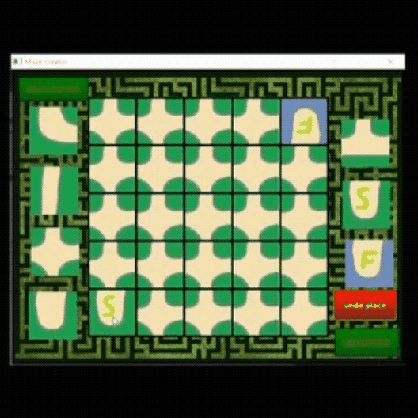

# 2020-COMP3016-Coursework2

The product will be a maze creator proof-of-concept game where the user/player will create a 5x5 maze from a selection of 7 different predefined maze pieces and the user will be able to define the pieces rotation, allowing them to create their own unique maze.

After this the user/player will be able to click a play button located at the bottom of the screen which will generate the maze that they have just designed for them self of someone else to play. the program will place them as a first-person player in the centre of the start tile. There opponents goal is to then get to the finish without getting too lost.

How does the user interact with your executable? How do you open and control the software you wrote (exe file)?

to open the project the user should naviagte to the .exe or application file and double click on it to open the project.

Once the user opens the application they will be shown a UI menu with a create button near the bottom center of the screen.
They can then click on this button which will take them to a create screen with a grid positioned in the center of the screen. This grid will allow the user to choose which piece will be in each position of the maze. This can be done by clicking on a loctaion on the grid. Then clicking and identifiying the piece that the user would like to change it to from the selection around the grid. The user is also then able to edit the roation of the piece by double clicking on its location.

For instance, selecting grid location (3, 2) and then the T junction from the top right hand corner and double clicking so that it changes rotation.

After this the user can select either the back button to go to the menu, the undo button to reset the maze to its starting maze or pressing the play button which puts the user into the 3D generated maze. In play mode the user/player will use the WASD keys to move around the maze and the mouse to look around. As well as this, there are collision boundaries on all walls so that if the player walks forward into a wall, they will not be able to travel throught it.

I also implemented for the user, a system in which if the player gets too lost while in the maze, they can  press the esc key to go back to the maze creator. After a little useability testing this became necassary as some mazes became too complicated or had flaws that were only discovered during game play.

How does the program code work? How do the classes and functions fit together and who does what?

The program code works by fisrt inisalizing a two dimentinal array so that all the positions conatin the value of 0 and the the fist position contains the staart and the last contains the finish.

Its then loads inn all of the images to create a sky box for later use as well as all of the modles that the program will  need to build the maze.

The maze build method loades all of the modles into there spesified location along with there collision bounds.

The player stuct creates a ring arount the player which is then used to detect its collision.

Optimisation

The program sets the size of the collision array once the user presses the play button so that a array is not inisalized with slots that are not used nor where more slots are used.

All of the modles are loaded in to a vecter so tha the program only neecs to load and look for then once and then they can be used over and over again.

What makes your program special and how does it compare to similar things? 

Where did you get the idea from?
I got the idea to make a maze creator while looking into openGL and seeing some of the openGL level creators. As well as this, the chess simulators inspired me to create a grid to move pieces around on the screen. Including a grid into my maze creator made the overall appearance neater and more self explanatory than other creators I had seen in the past.

What did you start with? 
I started with the base coursework2 project that loaded in a cube from its specified vertcice and then texture mapped an image on top or the faces of the cube. From this I then looked into some simple camera movement so I could try and get a better look around each face of the cube.

How did you make yours unique?
My project is unique as it uses Assimp to load in a set of models that I created myself within the blender model creator. As well as this, there is a skybox around the player to make the scene feel like it is much larger then it actually is. the pridject also makes tye maze in a grid so as that it is uniform as other creators that i looked at not give as much unifomaty. 

what coud be added/ improved?

the collision dectection response could be improved as currently it is only checking if the player walks straight into the walls of the maze.

More rules could be added to the Creator such as the outside mush contain a wall.

Vedio Report:

